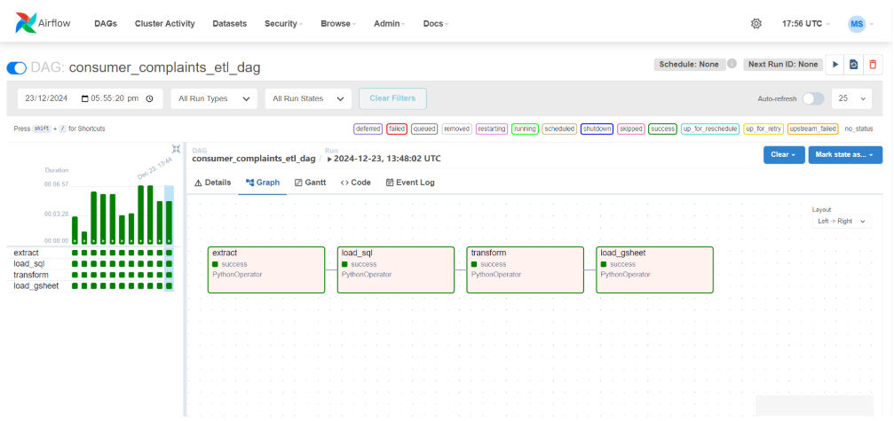
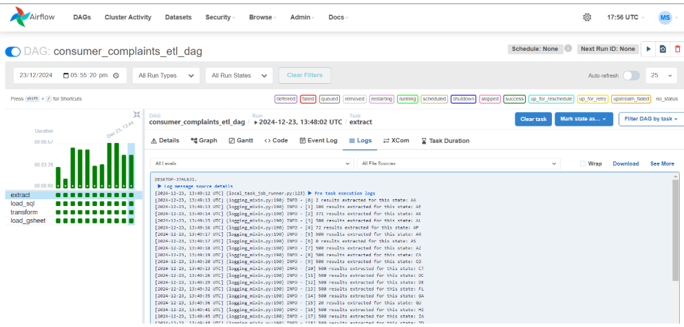
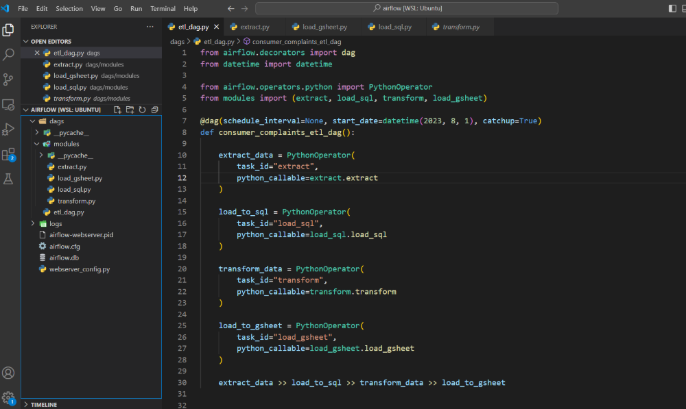
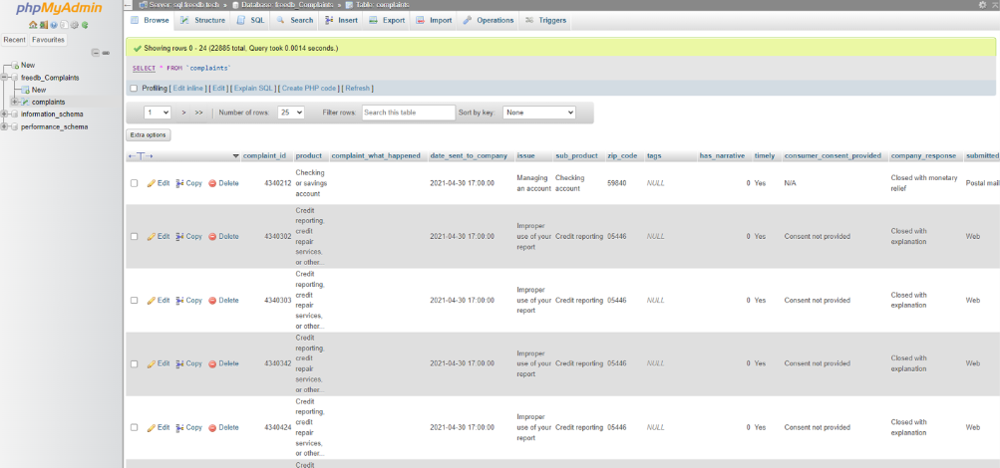
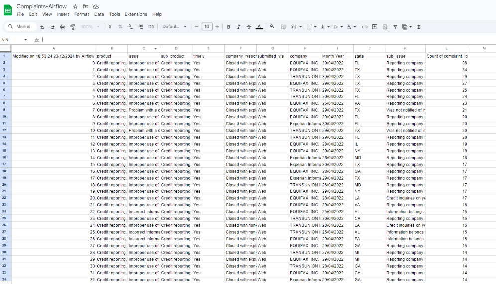

## Overview
Developed an ETL pipeline using Airflow to extract consumer complaint data from an API, load it into a MySQL database, 
transform it into a denormalized fact table, and update a Google Sheet for reporting. Implemented data extraction for 
all U.S. states, transformed raw data using Pandas, and created a monthly summary. Automated workflows with Airflow, 
used XCOM for task communication, and integrated Google Sheets API for real-time updates.


### The Graph View of the Dag


### Logs of Extracting Task


### Clean and Modular Code


### Data Loading to SQL Database


### Transformed data published to Google Sheets directly from Airflow


## How to Run?

- Clone this repo
```
git clone https://github.com/ShehzadAslamOza/consumer-complaints-etl-airflow.git
```

- Add database and google credentials in _load_sql.py_ and _load_gsheet.py_

- Install [Astro CLI](https://www.astronomer.io/docs/astro/cli/install-cli/)
- Start Airflow using
```
astro dev start
```
